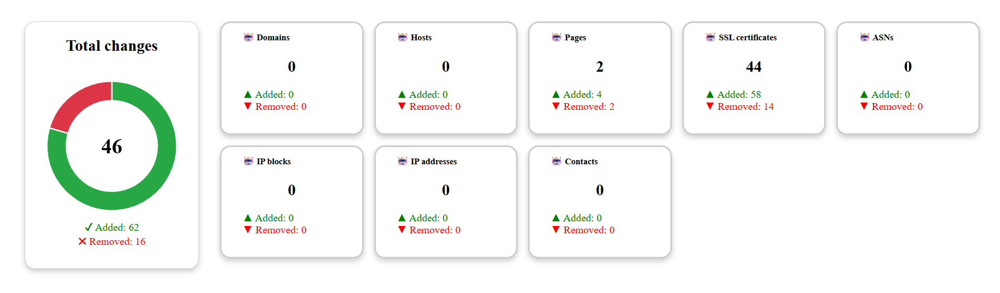

# Dashboard App (React + TypeScript + Vite)

This project is a dashboard application that combines React, TypeScript, and Vite to enable the development of modern web applications. It aims to provide fast development, easy customization, and the advantages of the modern JavaScript/TypeScript ecosystem.



## Features

- **Component-based UI** with React
- **Type safety** and enhanced IDE support with TypeScript
- **Fast builds and HMR** (Hot Module Replacement) with Vite
- **Modern UI** with @coreui/react and **charts** with @coreui/react-chartjs
- Dynamic cards and doughnut charts for statistical data visualization
- Easily extendable and customizable structure

## Getting Started

To run the project locally, follow these steps:

### Prerequisites

- [Node.js](https://nodejs.org/) (v18+ recommended)
- [npm](https://www.npmjs.com/) or [yarn](https://yarnpkg.com/)

### Installation

1. Clone the repository:

   ```sh
   git clone https://github.com/ardicDemirol/dashboard-app-ts.git
   cd dashboard-app-ts
   ```

2. Install dependencies:
   ```sh
   npm install
   # or
   yarn
   ```

### Development Server

To start the development server:

```sh
npm run dev
# or
yarn dev
```

Open [http://localhost:5173](http://localhost:5173) in your browser.

### Production Build

To build the project for production:

```sh
npm run build
# or
yarn build
```

### Linting

To check code quality:

```sh
npm run lint
# or
yarn lint
```

## Project Structure

```
src/
  App.tsx           # Main application component
  Card.tsx          # Statistic cards component
  ChartDoughnutAndPieExample.tsx  # Doughnut chart component
  data/
    stats.ts        # Sample static data
  styles/
    ChartCard.css   # Chart card specific styles
  App.css           # General application styles
public/
  index.html        # HTML entry point
```

## Main Dependencies

- **React** (`react`, `react-dom`)
- **Vite** (`vite`, `@vitejs/plugin-react`)
- **TypeScript**
- **@coreui/react**, **@coreui/react-chartjs** (UI and charts)
- **ESLint** and related plugins (for code quality)

## License

This project is licensed under the MIT License.

---

For more information or to contribute, please open an issue or submit a pull request!
